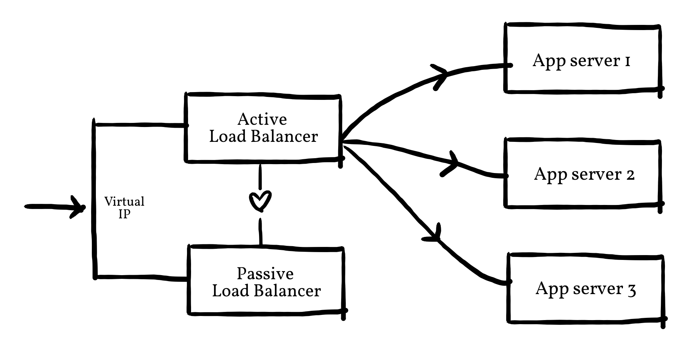

# Highly available, fault tolerant pine64 cluster



The topology contains 5 Pine A64's: 
- 2 HAProxy load balancers running in Docker containers, one active and one passive. 
- Keepalived heartbeat for failover and health checks. It is installed directly onto the two load balancers, outside of the containers. 
- 3 application servers, which are round-robinned across by the active load balancer. 

## Haproxy 
Contains the [Dockerfile](https://github.com/dimitraz/haproxy-arm64) and config file for `HAProxy` (arm64). 
Three app servers on three different pine64's are load balanced across using the round robin algorithm. 

## Keepalived
Contains two Keepalived configuration files for the active load balancer and the passive load balancer respectively. The `virtual ip` of both must be identical for failover. 

The script contained in the config files (`killall -0 haproxy`) sends a signal to the haproxy process to check whether it is running or not. 

**Note**: ensure that `killall` is available by installing the psmisc toolkit: 
```
sudo apt-get install psmisc
```

## Nginx 
Contains a Dockerfile for the arm64 nginx server and three slightly different variants of the same simple static web page (nice for debugging).

 

## Ansible
Contains ansible roles for: 
- Updating & upgrading ubuntu
- Installing software dependencies like Docker and Keepalived 
- Starting docker 
- Building and launching the docker containers for the servers and the load balancers
- Configuring Keepalived  

### Configuring Ansible on the pines
- To avoid typing passwords each time, copy the contents of your SSH key `~/.ssh/id_rsa.pub` to a file in each device called `~/.ssh/authorized_keys`.
- Make sure Python is installed on each (Python is an Ansible dependency):  
```
sudo apt-get install -y python
```
- Make a new file called `overrides` or `myOverrides` in the `sudoers.d` directory:
```
sudo visudo -f /etc/sudoers.d/myOverrides
```
and add a new line for the ubuntu user: 
```
ubuntu ALL=(ALL:ALL) ALL
```
- Use Ansible's `Ping` module to verify connectivity:
```
ansible -m ping all
```

## Testing on Localhost
The `docker-compose` file is included for simpler testing on localhost. 

Make sure to change the servers in the `haproxy.cfg` file and uncomment the non-arm64 base images in the nginx
and haproxy dockerfiles.
